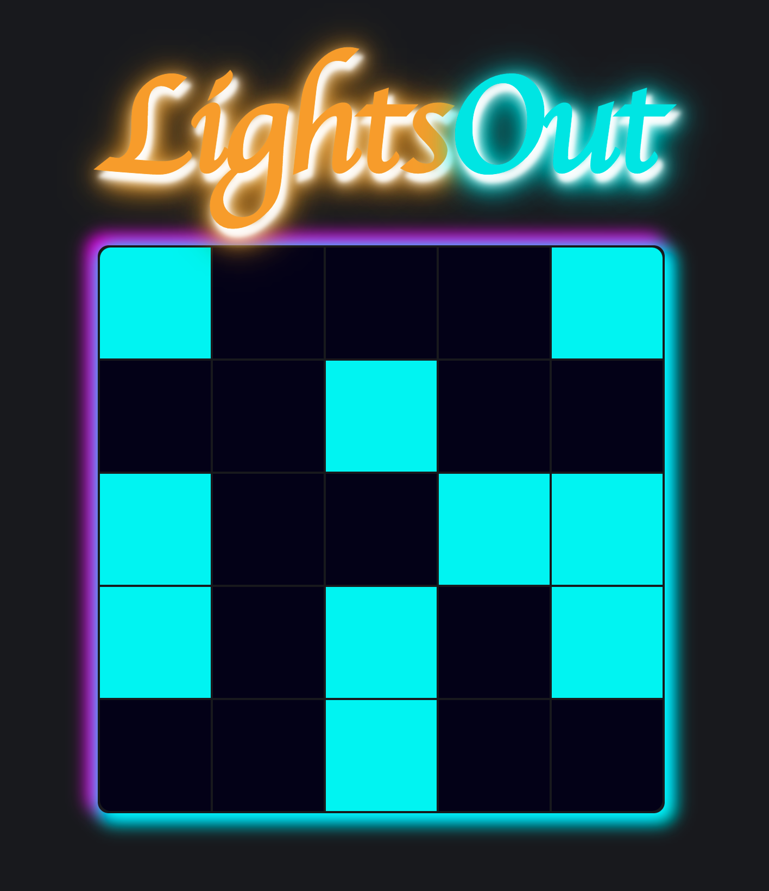

# Lightsout - a browser game


## Table of Contents
* [Introduction](#introduction)
* [Motivation](#motivation)
* [Technologies](#technologies)
* [Setup](#setup)

## Introduction
Lights Out is a classic simple game where the user is presented a grid of light, some randomly turned on. The user's aim is to turn off every light, but when ever one light is toggled, it also toggles each of its neighbors. 

## Motivation
I developed this while learning React. In particular, this application gave me an opportunity to better understand the principles of managing State in React, namely centralizing state in parent components and downward data flow.

## Technologies
Project created with:
* React version: 17.0.2

## Todo
* Ensure only solveable boards are generated
* Add unit tests

## Setup
To Run this project, install it using npm
```
$ cd lightsout
$ npm install
$ npm start
```